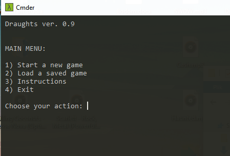
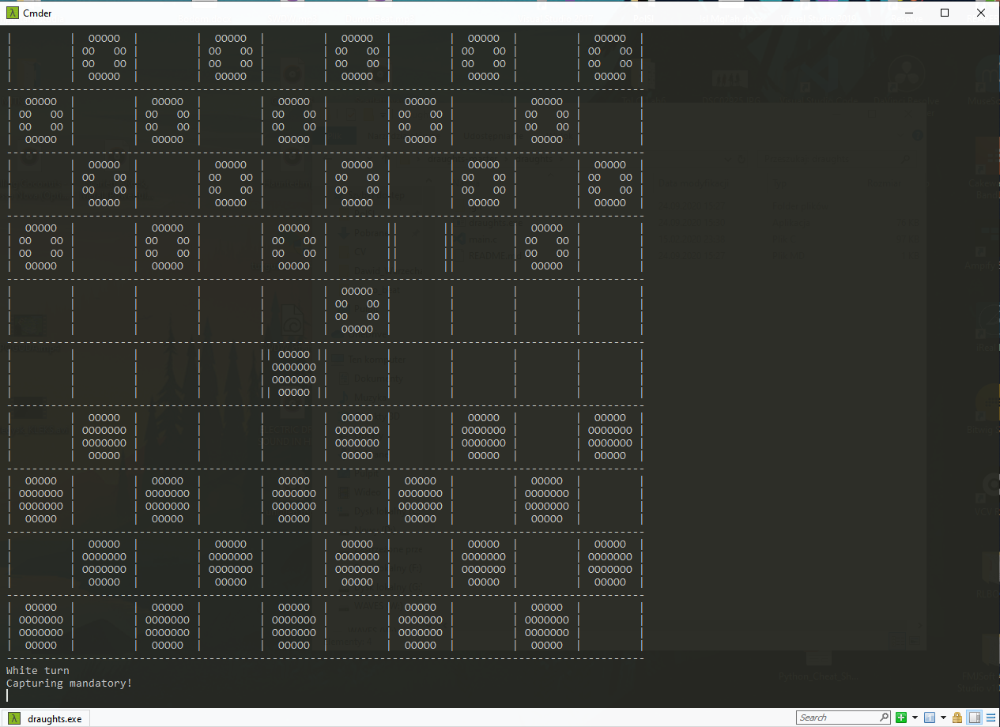

# draughts

My first university C project

## Task topic
Write a console version of the popular draughts game. The code should contain elements you learnt during your FoCP course, for example structures, functions, arrays, file operations etc.
